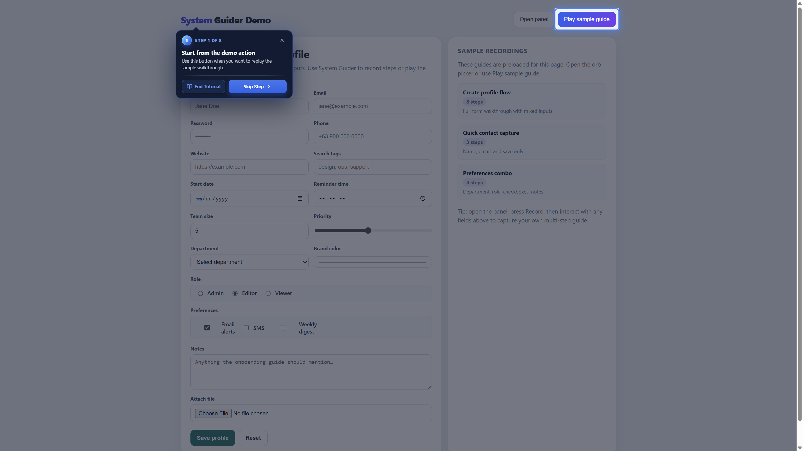
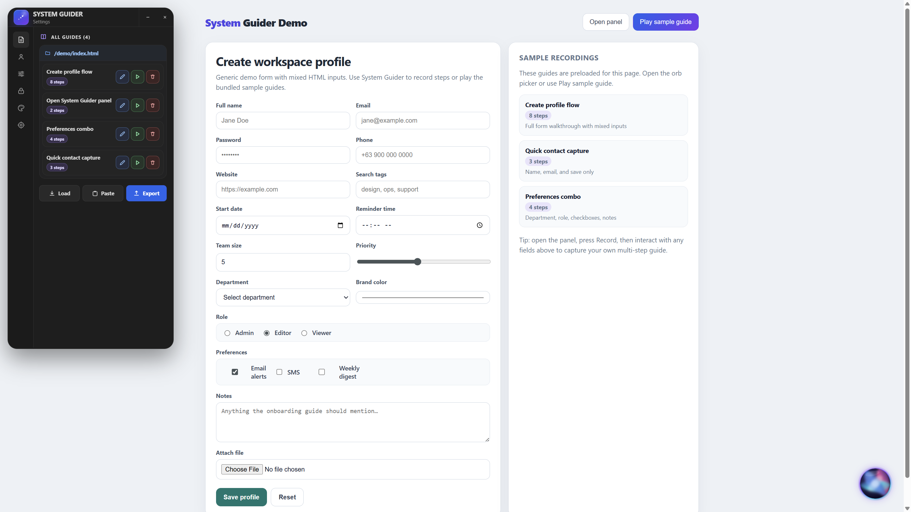
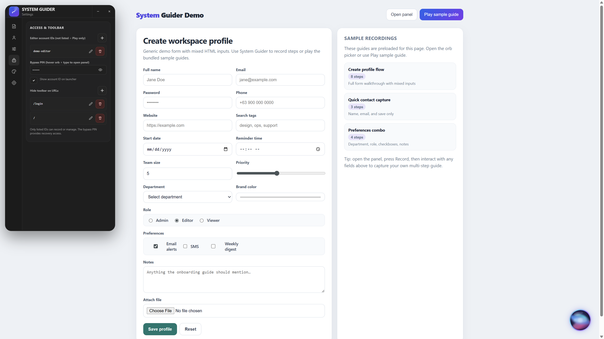
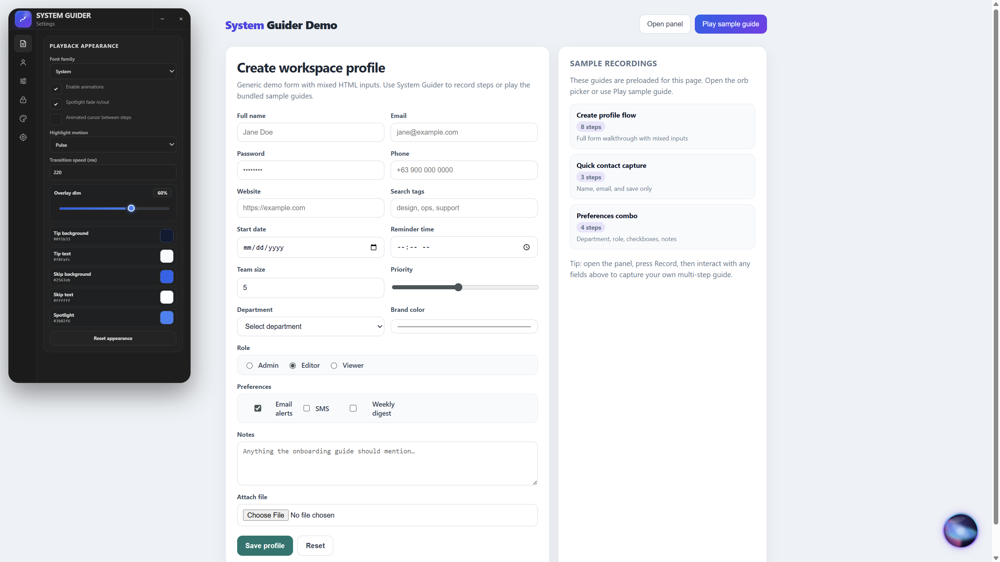

# System Guider

Framework-independent JavaScript library for **recording, editing, and replaying interactive UI guides** on top of your existing app — no special markup required.

**[Live demo](https://jaimarbacs-prog.github.io/system-guider/)** — try record / play in the browser (no install).

<p align="center">
  
</p>

<p align="center"><em>Playback highlight: spotlight on the target, coachmark tip with step progress, description, End Tutorial, and Skip Step.</em></p>

## Purpose

Help teams ship **in-product walkthroughs** that stay tied to the real UI:

- Train new users without separate training sites
- Document flows that change with the product
- Let editors record once and replay for everyone else

System Guider overlays your page: it dims the rest of the screen, spotlights the active control, and shows a step tip with clear next actions.

## Description

| Piece | What it does |
|---|---|
| **Floating orb / launcher** | Play guides, start recording, open the panel, stop a running tutorial |
| **Settings panel** | Manage guides, account access, defaults, appearance, and orb options |
| **Spotlight + tip** | Highlights the target; tip shows step title, optional description, and actions |
| **JSON guides** | Export/import or save under `public/guides/` (with Laravel or your own API) |

Recording captures clicks and form interactions **without storing typed values**. Playback waits on inputs when needed and recovers with Skip when a target is missing.

## Features

- Record and replay against your existing UI — no markup changes required
- Captures clicks and form interactions without storing typed values
- Left settings panel for guides, access, defaults, and appearance
- Spotlight overlay with a coachmark tip (arrow toward the highlight)
- Smart step titles/descriptions when recording (labels, headings, chart context)
- Export/import as JSON; optional draft persistence
- ESM and UMD builds with TypeScript declarations

## Panel settings

Open the panel from the launcher (**Panel**) when your account is allowed to edit. The left icon rail switches sections:

| Section | Role |
|---|---|
| **Guides** | List, edit, play, delete guides; Load / Paste / Export |
| **Account** | Shows the current account ID from the host app |
| **Defaults** | Reload-before-play, resume delay, theme (dark/light) |
| **Access** | Editor account IDs, bypass PIN, hide toolbar on URLs |
| **Appearance** | Tip/spotlight colors, overlay dim, highlight motion, fonts |
| **Orb** | Launcher size, position, animation |

### Guides

<p align="center">
  
</p>

- Guides are grouped by page path
- Each row: **Edit**, **Play**, **Delete**
- **Load** / **Paste** / **Export** for JSON workflows

### Access

<p align="center">
  
</p>

- **Editor account IDs** — only listed IDs can record/manage; others are Play-only
- **Bypass PIN** — hover the orb and type the PIN to unlock the panel for recovery
- **Hide toolbar on URLs** — e.g. `/login`, `/`
- **Show account ID on launcher** — optional debug aid

### Appearance

<p align="center">
  
</p>

- Font family
- Animations, spotlight fade, animated cursor
- Highlight motion: none / pulse / wobble / fade
- Transition speed and overlay dim
- Colors: tip background/text, skip button, spotlight

## Highlight tip (playback)

During playback the tip shows:

1. Step badge + **STEP X OF Y**
2. Title (and optional description)
3. **End Tutorial** — stops the whole guide
4. **Skip Step** — advances to the next step
5. A caret arrow that points toward the highlighted element

Tip and spotlight colors follow **Appearance** settings (`tipBg`, `spotlightColor`, etc.).

## Installation

```bash
npm install system-guider
```

Also import the styles wherever you init the guider:

```js
import 'system-guider/style.css'
```

Git install (if you prefer the repo directly):

```bash
npm install github:jaimarbacs-prog/system-guider#main
# or a tagged release:
# npm install github:jaimarbacs-prog/system-guider#v1.0.0
```

## Framework setup

Pick the pattern that matches your app. In every case you must:

1. Import the CSS
2. Call `SystemGuider.init(...)` once
3. Call `setAccountId(...)` with the logged-in user id (required for Record / Panel)

Without file storage, use Download / Load JSON from the panel. For persisted guides on Laravel, use the publisher below or your own save API.

### Plain JavaScript (Vite / webpack / CDN)

```js
// main.js (or any entry file)
import SystemGuider from 'system-guider'
import 'system-guider/style.css'

const guider = SystemGuider.init({
  showLauncher: true,
  storageKey: 'app:guider-draft',
})

// After login / when auth is known:
guider.setAccountId(currentUserId)
```

Script tag (UMD):

```html
<link rel="stylesheet" href="/vendor/system-guider/system-guider.css">
<script src="/vendor/system-guider/system-guider.umd.js"></script>
<script>
  const guider = SystemGuider.init({ showLauncher: true })
  guider.setAccountId(window.__USER_ID__ ?? null)
</script>
```

### Laravel + Inertia (Vue 3)

System Guider is plain JS. **Do not replace** your existing `createInertiaApp` / `resolve` / `createApp` code.

Only **add** the highlighted pieces below into your current `resources/js/app.js`.

#### Step A — import the init (top of `app.js`)

```js
import './system-guider-init.js'   // ← ADD (after npm run system-guider:install)
```

#### Step B — ensure `router` is imported from Inertia

If you already import from `@inertiajs/vue3`, add `router` to that import:

```js
import { createInertiaApp, router } from '@inertiajs/vue3'   // ← ADD router
```

#### Step C — add the sync helper + navigate listener

Paste this **near your other imports / before `createInertiaApp`** (not inside a Vue component):

```js
// ← ADD: sync logged-in id into System Guider
function syncGuiderAccountId(pageProps) {
  // Map this to YOUR shared Inertia props (HandleInertiaRequests / share()).
  // Examples — keep only the path your app actually uses:
  //   pageProps?.auth?.user?.id
  //   pageProps?.auth?.account?.id
  //   pageProps?.user?.id
  const accountId = pageProps?.auth?.user?.id ?? null

  window.systemGuider?.setAccountId?.(
    accountId == null || accountId === '' ? null : String(accountId),
  )
}

// ← ADD: soft visits (setup does not re-run)
router.on('navigate', (event) => {
  syncGuiderAccountId(event.detail.page.props)
})
```

#### Step D — one line inside your existing `setup()`

Keep your own `createApp` / plugins / `.mount(el)` as-is. Only add the sync call **after mount**:

```js
createInertiaApp({
  // …keep your existing resolve / title / progress …
  setup({ el, App, props, plugin }) {
    // …keep your existing createApp(...).use(...).mount(el) …

    // ← ADD: first page load only
    syncGuiderAccountId(props.initialPage?.props ?? props)
  },
})
```

#### Why two sync calls?

| When | What to call | Path |
|---|---|---|
| **First boot** | inside `setup()` | `props.initialPage?.props` |
| **Soft visit** | `router.on('navigate')` | `event.detail.page.props` |

Same page-props object, different wrappers (Inertia built-ins — not System Guider keywords):

```text
setup:     props.initialPage.props
navigate:  event.detail.page.props
```

- `router` — Inertia client router (`@inertiajs/vue3`), not Vue Router  
- `accountId` must match an entry in `public/guides/settings.json` → `editorAccountIds`  

#### `system-guider-init.js`

Published by `npm run system-guider:install` (or create manually). You usually **do not edit** this from `app.js` beyond importing it:

```js
import SystemGuider from 'system-guider'
import 'system-guider/style.css'

window.systemGuider = SystemGuider.init({
  showLauncher: true,
  guidesByUrl: true,
  fileStorage: {
    baseUrl: '/__sg/guides',
    publicBase: '/guides',
    downloadFallback: false,
  },
  storageKey: 'app:guider-draft',
  accountId: null, // set from Inertia via setAccountId
})
```

Add matching ids in `public/guides/settings.json` → `editorAccountIds`.

### React (Vite / CRA / SPA)

```jsx
// main.jsx
import React from 'react'
import { createRoot } from 'react-dom/client'
import App from './App'
import SystemGuider from 'system-guider'
import 'system-guider/style.css'

window.systemGuider = SystemGuider.init({
  showLauncher: true,
  storageKey: 'app:guider-draft',
})

createRoot(document.getElementById('root')).render(
  <React.StrictMode>
    <App />
  </React.StrictMode>,
)
```

Sync the account id from your auth layer (context, store, or session fetch):

```jsx
// AuthProvider.jsx (example)
import { useEffect } from 'react'
import { useAuth } from './useAuth' // your hook

export function SyncSystemGuiderAccount() {
  const { user } = useAuth()

  useEffect(() => {
    window.systemGuider?.setAccountId?.(user?.id ?? null)
  }, [user?.id])

  return null
}
```

```jsx
// App.jsx
import { SyncSystemGuiderAccount } from './AuthProvider'

export default function App() {
  return (
    <>
      <SyncSystemGuiderAccount />
      {/* routes / layout */}
    </>
  )
}
```

If you use **React Router**, re-call `setAccountId` after login/logout; URL changes alone do not require re-init — System Guider already watches `pathname` when `guidesByUrl` is on.

### React + Inertia

Same idea: **do not replace** your existing `createInertiaApp`. Only add:

```jsx
import './system-guider-init.js'                          // ← ADD
import { createInertiaApp, router } from '@inertiajs/react' // ← ADD router

function syncGuiderAccountId(pageProps) {                 // ← ADD
  // Map to YOUR shared Inertia props, e.g. auth.user.id / user.id
  const accountId = pageProps?.auth?.user?.id ?? null
  window.systemGuider?.setAccountId?.(
    accountId == null || accountId === '' ? null : String(accountId),
  )
}

router.on('navigate', (event) => {                        // ← ADD
  syncGuiderAccountId(event.detail.page.props)
})
```

Inside your existing `setup()`, after render:

```jsx
setup({ el, App, props }) {
  // …keep your existing createRoot(el).render(...) …

  syncGuiderAccountId(props.initialPage?.props ?? props)  // ← ADD
}
```

### Laravel host

Publishes a PHP save API, `public/guides/`, and a frontend init stub. Do these steps in order.

**1. Install the package** (command above).

**2. Register the install script** in `package.json` (once):

```json
"scripts": {
  "system-guider:install": "node node_modules/system-guider/integrations/laravel/install.js"
}
```

**3. Publish** controller, routes, guides folder, and init stub:

```bash
npm run system-guider:install
```

Force overwrite: `npm run system-guider:install -- --force`

**4. Wire the frontend** — import the published init from your JavaScript entry file:

```js
import './system-guider-init.js'
```

Then sync the logged-in account id (Inertia Vue example — add only these lines; keep your existing `createInertiaApp` body):

```js
import { createInertiaApp, router } from '@inertiajs/vue3'

function syncGuiderAccountId(pageProps) {
  // Map to YOUR auth shape
  const accountId = pageProps?.auth?.user?.id ?? null
  window.systemGuider?.setAccountId?.(
    accountId == null || accountId === '' ? null : String(accountId),
  )
}

router.on('navigate', (event) => {
  syncGuiderAccountId(event.detail.page.props)
})

// inside setup(), after mount:
syncGuiderAccountId(props.initialPage?.props ?? props)
```

See [Framework setup](#framework-setup) for plain JS and React samples.

**5. Allow editors** — the install always creates `public/guides/settings.json`. Add account ids that may record and manage guides:

```json
{
  "version": 1,
  "resetBeforePlay": "none",
  "reloadOnNavigate": false,
  "resetBeforePlayDelay": 450,
  "editorAccountIds": ["1", "12"]
}
```

An empty `editorAccountIds` list means Play-only for everyone. The current user’s id (step 4) must match an entry in this list.

**6. Rebuild frontend assets:**

```bash
npm run dev
```

Full details: [`integrations/laravel/README.md`](integrations/laravel/README.md).

First-time unlock without an allow-list: hover the launcher orb and type the bypass PIN (default `123456`) to open Global Settings and edit the list in the UI.

## Quick start

```js
import SystemGuider from 'system-guider'
import 'system-guider/style.css'

const guider = SystemGuider.init({
  showLauncher: true,
  storageKey: 'app:guider-draft',
  fileStorage: {
    baseUrl: '/__sg/guides',
    publicBase: '/guides',
    downloadFallback: false,
  },
})

// Required for Record / Panel — must match an id in public/guides/settings.json
guider.setAccountId(currentUserId)
```

Or keep init in a separate module and import it from your entry:

```js
import './system-guider-init.js'
```

**Save for page** writes `public/guides/{route}/{name}.json`.  
**Play page guide** loads `/guides/index.json` and those files.

Guides are stored in the **host app**, not in this repository.

### Script tag

After building (or copying from `dist/`):

```html
<link rel="stylesheet" href="/vendor/system-guider/system-guider.css">
<script src="/vendor/system-guider/system-guider.umd.js"></script>
<script>
  SystemGuider.init({ panelPosition: 'left' })
</script>
```

## Live demo

Online: **[https://jaimarbacs-prog.github.io/system-guider/](https://jaimarbacs-prog.github.io/system-guider/)**

The site is built from `demo/` and published with GitHub Pages (Actions workflow `.github/workflows/deploy-demo.yml`). After the first push to `main`, enable Pages once:

1. Repo **Settings → Pages**
2. **Source:** GitHub Actions
3. Wait for the **Deploy demo** workflow to finish

## Local demo

```bash
git clone https://github.com/jaimarbacs-prog/system-guider.git
cd system-guider
npm install
npm run build
npm run dev
```

Open the URL printed by Vite (typically `http://localhost:5173/demo/index.html`).

Build / preview the same static site that goes to GitHub Pages:

```bash
npm run build:demo
npm run preview:demo
```

The demo is a generic workspace profile form with mixed HTML inputs (text, email, password, date, select, radio, checkbox, textarea, file, and more) plus several preloaded sample guides/recordings.

## Usage

### Floating launcher

With `showLauncher: true` (default), controls include:

1. **Play guides** — play guides for the current URL (picker if several)
2. **Record** — start capturing a new flow
3. **Panel** — open settings (Guides, Account, Defaults, Access, Appearance, Orb)
4. **Stop** — end a running tutorial

```js
SystemGuider.init({
  showLauncher: true,
  guidesByUrl: true,
  urlMatch: 'pathname', // or 'full'
  guides: {
    '/dashboard': onboardingGuide,
    '/settings': [profileGuide, securityGuide],
  },
})
```

Guides are keyed by pathname by default. One guide plays immediately; multiple guides open a picker. After recording, name the guide in Manage mode and use **Save for page**.

### File storage

Guides are plain JSON under `public/guides/`.

| Action | Behavior |
|---|---|
| Play | `GET /guides/index.json` (static; no backend required) |
| Save | `POST /__sg/guides` (optional; browsers cannot write disk alone) |

Vite dev middleware (optional):

```js
// vite.config.js
import { createGuideStorageMiddleware } from 'system-guider/guide-storage'
import { resolve } from 'path'

export default defineConfig({
  configureServer(server) {
    server.middlewares.use(
      createGuideStorageMiddleware({
        guidesRoot: resolve(__dirname, 'public/guides'),
      }),
    )
  },
})
```

Without a save API, set `fileStorage: false` and use Download / Load JSON from the panel.

### Playback reset

By default, play reloads the page first so the UI starts from a clean state:

```js
SystemGuider.init({
  resetBeforePlay: 'reload', // default
  // resetBeforePlay: 'none',
  resetBeforePlayDelay: 450,
})
```

Custom URL key (SPAs / hash routes):

```js
SystemGuider.init({
  getUrlKey: () => window.location.hash || window.location.pathname,
})
```

### Record → edit → ship

1. Start recording from the panel (or `guider.startRecording()`).
2. Perform the flow in your app; stop recording.
3. Edit titles, remove or reorder steps, preview targets on hover.
4. Download JSON or **Save for page**, then play for end users.

```js
const guider = SystemGuider.init({ storageKey: 'app:guide-draft' })

guider.startRecording()
// …user completes the flow…
const guide = guider.stopRecording()

guider.load(guide).start()
```

Example guides: [`demo/guides/create-profile.json`](demo/guides/create-profile.json), [`demo/guides/quick-contact.json`](demo/guides/quick-contact.json), [`demo/guides/preferences-combo.json`](demo/guides/preferences-combo.json).

## Guide schema

```json
{
  "id": "example-flow",
  "title": "Example flow",
  "version": 1,
  "steps": [
    {
      "id": "pick-date",
      "selector": "#date-field",
      "action": "input",
      "title": "Choose a date",
      "description": "Select the date for this record.",
      "waitFor": { "type": "input", "required": true }
    }
  ]
}
```

Actions: `click`, `input`, `manual`. Manual steps may omit `selector`.

## Target scoring

Recording stores a CSS selector plus match hints (`id`, label text, `name`, `href`, section, etc.). On playback, if the primary selector is weak or missing, candidates are ranked and the best match is used.

No HTML changes are required. Optional `data-guider="…"` attributes on critical controls improve stability when the UI changes often.

| Signal | Approx. score |
|---|---|
| `data-guider` exact (optional) | +100 (mismatch −40) |
| element `id` exact | +80 |
| `href` exact / suffix / partial | +45 / +28 / +12 |
| visible text exact / word-set | +50 / +40 |
| section label | +30 / +12 |
| `name` / `role` / `type` / `tag` | +25 / +6 / +6 / +4 |

Default accept threshold: **40**. Resolution: CSS selector → scored candidates (`data-guider` ranks highest when present).

```html
<!-- Optional -->
<button data-guider="save-form">Save</button>
```

## API

```js
const guider = SystemGuider.init(options)

guider.startRecording()
const guide = guider.stopRecording()
guider.load(guide)
guider.updateSteps(steps)
guider.removeStep(stepId)
guider.moveStep(stepId, newIndex)
guider.start()
guider.startFrom(stepIdOrIndex)
guider.next()
guider.prev()
guider.skip()
guider.close()
guider.exportJSON()
guider.downloadJSON(filename)
await guider.copyJSON()
guider.destroy()
```

Common options: `overlayOpacity`, `allowClose`, `storageKey`, `zIndex`, `selectorTimeout`, `autoAdvanceOnInput`, `autoAdvanceDelay`, `labels`, lifecycle callbacks.

Input steps auto-advance after a non-empty value (debounced, default 600 ms). Dropdown steps advance on any committed selection. Only one instance is active; a new `init()` destroys the previous one.

## Security and limitations

- Password fields and `[data-guider-ignore]` are not recorded
- Typed values are never stored in guide JSON
- Loaded JSON is validated before use
- v1 does not support iframes, cross-origin pages, multi-tab sync, or deep shadow roots
- Safe to import under SSR; `init()` throws outside a browser

## Verification checklist

1. Start recording in the panel
2. Complete a short multi-step flow (field, dropdown, submit)
3. Stop recording and edit steps
4. Remove and reorder a step; confirm numbering
5. Hover a step to preview its target
6. Download, reload, and play the guide
7. Confirm input steps block Next until a value is set
8. Confirm a missing selector shows Skip instead of crashing

## Uninstall

```bash
npm uninstall system-guider
```

Then remove:

1. Any `import './system-guider-init.js'` or `SystemGuider.init(...)` from your entry file
2. The `system-guider:install` script from `package.json` (if added)
3. Laravel publisher artifacts (`routes/system-guider.php`, controller) if used
4. Optionally `public/guides/`

Rebuild frontend assets afterward.

## License

MIT
